# Private SOC Lab

## Overview
This project is a private SOC lab built to simulate attacks and monitor security events using Kali Linux, Wazuh SIEM, Suricata IDS, and an Ubuntu victim server. The lab is designed as a hands-on cybersecurity learning environment for attack simulation, detection validation, and SOC portfolio development.

## Lab Topology
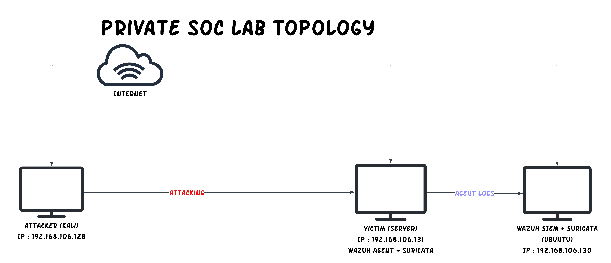

## Objectives
- Simulate basic cyber attacks in a controlled lab
- Monitor logs and alerts through Wazuh
- Detect suspicious traffic with Suricata
- Build a portfolio-ready SOC project

## Lab Components
- Kali Linux — Attacker
- Ubuntu Server with Wazuh — SIEM / Monitoring
- Ubuntu Live Server with Suricata + Wazuh Agent — Victim

## Network Information
- Kali Linux (Attacker): `192.168.106.128`
- Ubuntu Server with Wazuh (SIEM): `192.168.106.130`
- Ubuntu Live Server with Suricata + Wazuh Agent (Victim): `192.168.106.131`
- Internal network: `192.168.106.0/24`

## Tools Used
- Kali Linux
- Wazuh SIEM
- Suricata IDS
- Ubuntu Live Server
- SSH
- Nmap

## Attack Scenarios
The lab is used to simulate several basic attack scenarios in a controlled environment, including:
- ICMP ping activity
- TCP SYN scan activity using Nmap
- SSH access attempts
- SSH brute-force-like bursts
- Suspicious outbound connection activity on port 4444

## Detection Rules
Custom detection rules were created in Suricata to identify suspicious or malicious traffic generated during the lab simulations. These rules were designed to detect several common attack patterns and network events.

The implemented custom rules include:
- ICMP ping detection
- ICMP flood-like activity
- TCP SYN scan activity
- TCP SYN flood-like activity
- SSH access to server
- SSH brute-force-like bursts
- Suspicious outbound connection to TCP port 4444

## Suricata Integration with Wazuh
Suricata is integrated with Wazuh by forwarding EVE JSON logs through the Wazuh agent to the Wazuh manager. This allows Suricata network alerts generated on the victim machine to be collected, parsed, and monitored through the SIEM platform.

Suricata log source:
- `/var/log/suricata/eve.json`

Suricata custom rules:
- `/var/lib/suricata/rules/local.rules`

## Monitoring Workflow
1. The attacker machine generates simulated attack traffic toward the victim server.
2. Suricata running on the victim analyzes the traffic and generates alerts based on custom rules.
3. Suricata writes the events into `eve.json` on the victim machine.
4. Wazuh reads the Suricata JSON logs from the victim through the agent configuration.
5. The logs are forwarded to the Wazuh manager for centralized monitoring and analysis.
6. Alerts and events can then be reviewed in the Wazuh dashboard.

## Evidence and Screenshots
The following screenshots document the setup, configuration, and detection results of the lab environment:
- Lab topology diagram
- IP configuration of each virtual machine
- Wazuh manager service status
- Wazuh agent service status
- Suricata service status
- SSH service status
- Suricata custom rules
- Wazuh integration with Suricata
- Suricata configuration test results
- Attack simulation activity
- Suricata alert logs in `fast.log` and `eve.json`
- Wazuh dashboard alerts

## Key Screenshots

### Lab Topology

### IP Configuration

#### Kali Linux
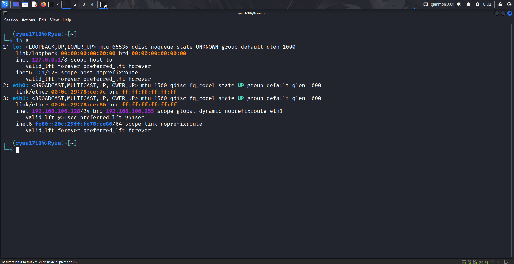

#### Wazuh SIEM
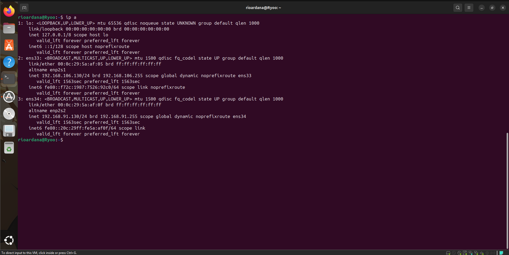

#### Victim Server
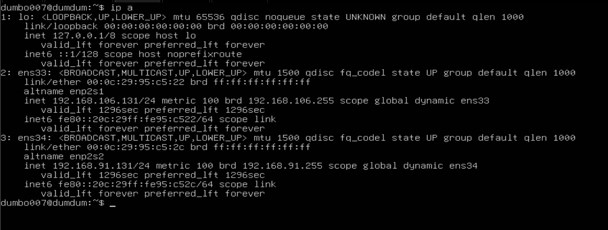

### Service Status

#### Wazuh Manager
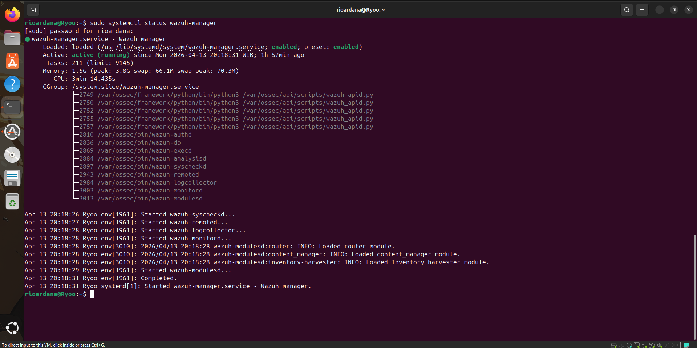

#### Wazuh Agent on Victim
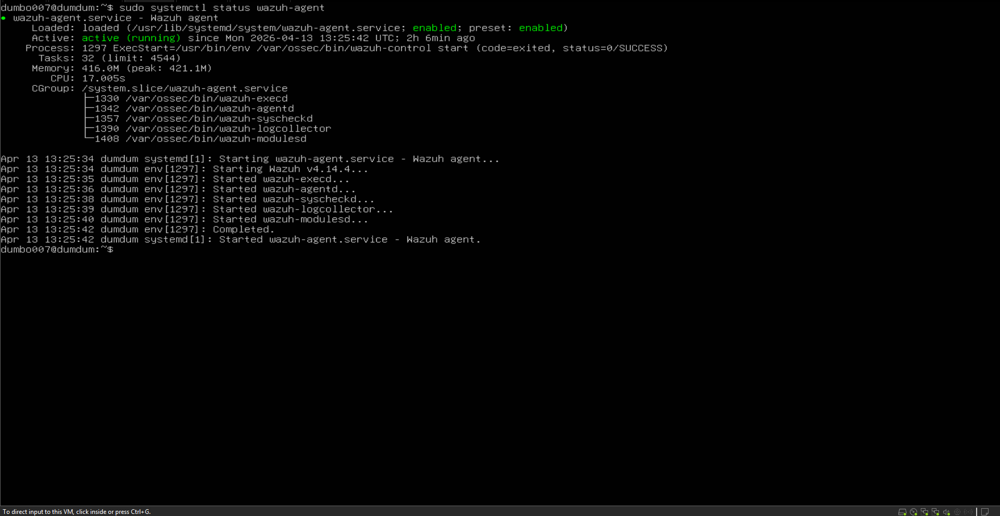

#### Suricata on Victim
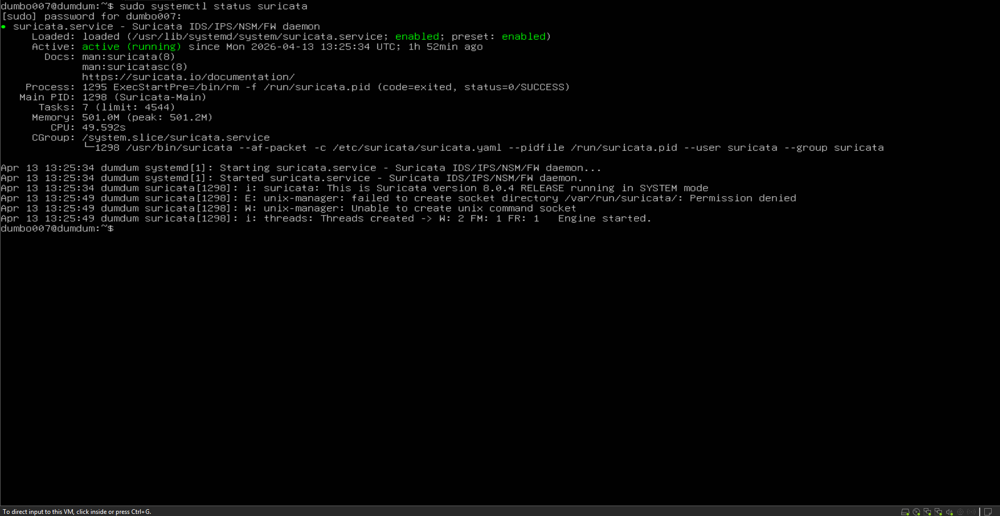

#### SSH on Victim
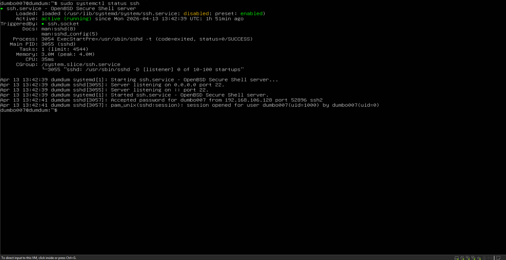

### Configuration and Rules

#### Suricata Custom Rules
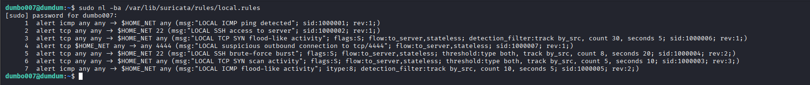

#### Suricata and Wazuh Integration
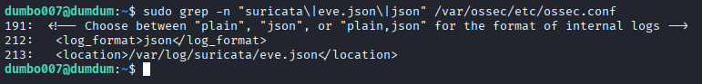

#### Suricata Configuration Test
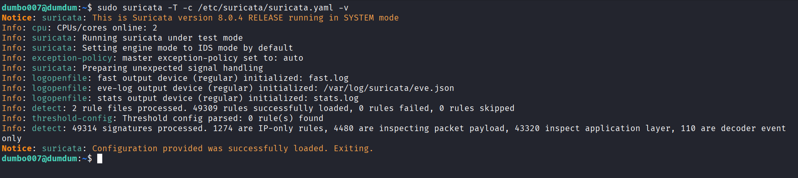

### Attack Simulation

#### Ping Test
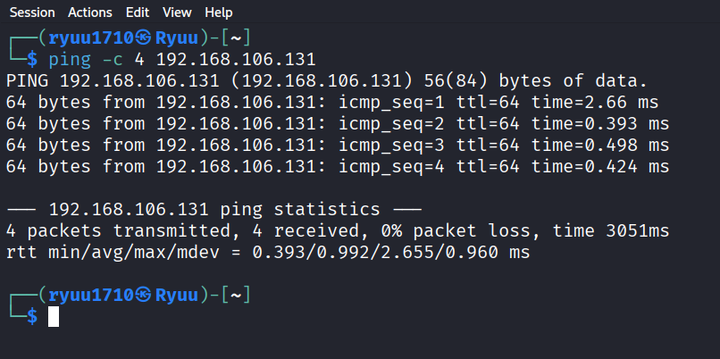

#### Nmap Scan
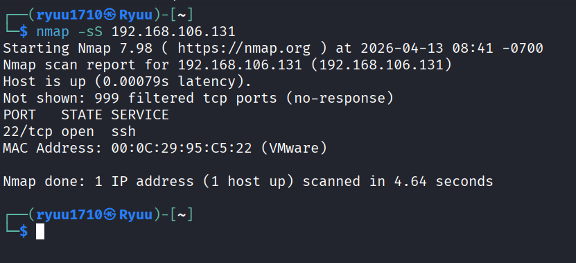

#### SSH Access Test
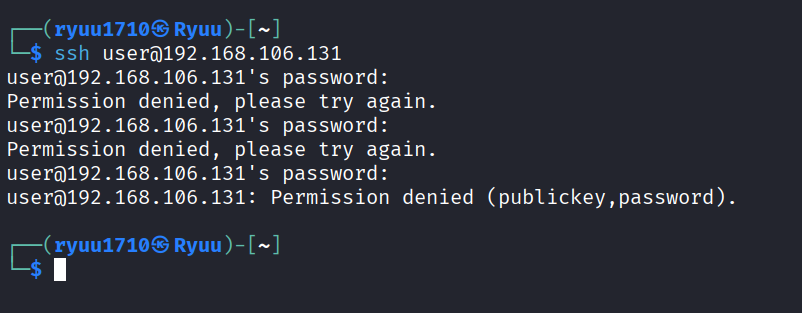

### Detection Results

#### Suricata Fast Log Alert
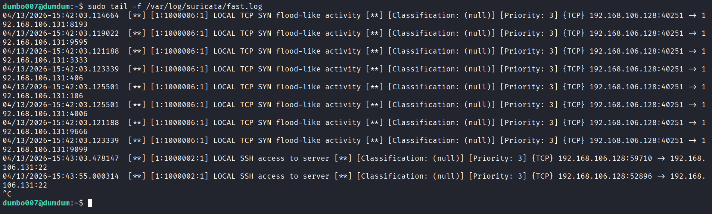

#### Suricata EVE JSON Alert
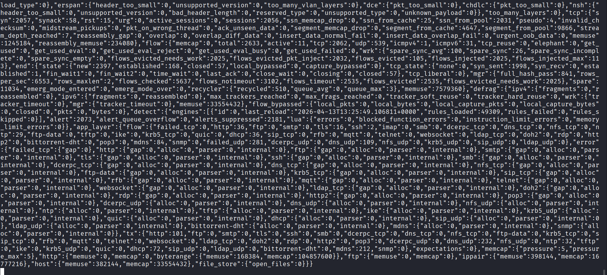

#### Wazuh Dashboard Events
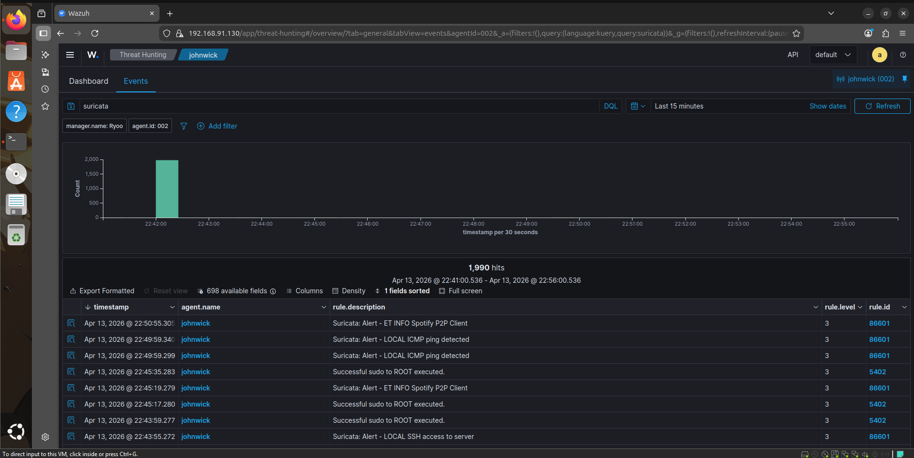

#### Wazuh Alert Detail
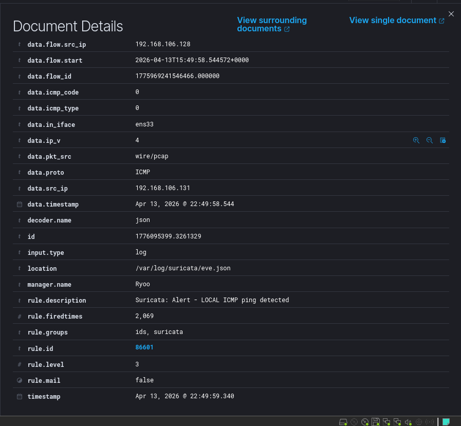

## Current Project Status
This lab environment has been successfully set up and documented. Core attack simulations and detections have been validated, and the project now serves as a practical SOC portfolio lab demonstrating network monitoring, alert generation, and centralized log analysis.

## Future Improvements
- Add more attack simulation scenarios
- Create more custom Suricata detection rules
- Improve alert correlation in Wazuh
- Expand the lab with additional endpoints
- Add incident investigation notes and response playbooks
- Document detection tuning and false positive analysis

## Author
**Matthew Benedict Ezekiel Saisab**  
Cybersecurity learner and Informatics undergraduate at Universitas Atma Jaya Yogyakarta, building hands-on SOC lab projects for learning and internship preparation.
