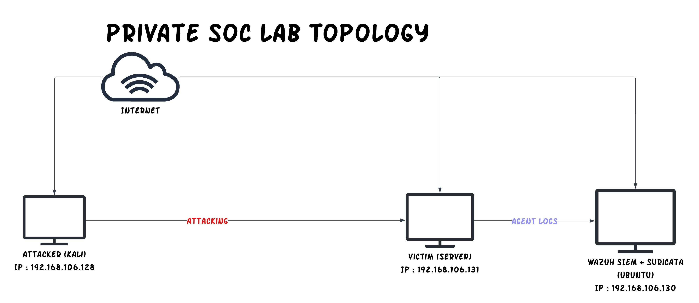

# Private SOC Lab

## Overview
This project is a private SOC lab built to simulate attacks and monitor security events using Kali Linux, Wazuh SIEM, Suricata IDS, and an Ubuntu victim server.

## Lab Topology

## Objectives
- Simulate basic cyber attacks in a controlled lab
- Monitor logs and alerts through Wazuh
- Detect suspicious traffic with Suricata
- Build a portfolio-ready SOC project

## Lab Components
- Kali Linux — Attacker
- Ubuntu Server with Wazuh + Suricata — SIEM / Monitoring
- Ubuntu Live Server — Victim

## Network Information
- Kali Linux (Attacker): `192.168.106.128`
- Ubuntu Live Server (Victim): `192.168.106.131`
- Ubuntu Server with Wazuh + Suricata (SIEM): `192.168.106.130`
- Internal network: `192.168.106.0/24`

## Tools Used
- Kali Linux
- Wazuh SIEM
- Suricata IDS
- Ubuntu Live Server
- SSH
- Nmap

## Attack Scenarios
The lab is used to simulate several basic attack scenarios in a controlled environment, including:
- ICMP ping activity
- TCP SYN scan activity using Nmap
- SSH access attempts
- SSH brute-force-like bursts
- Suspicious outbound connection activity on port 4444
